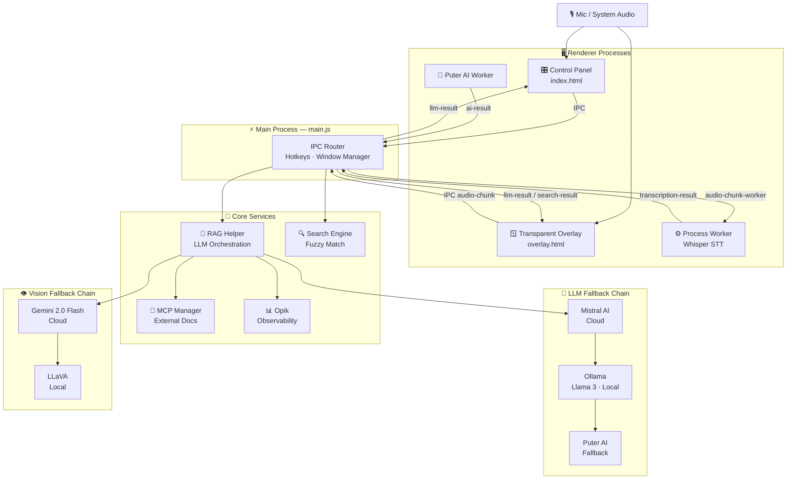

# 🎯 Interview Assistant

### The AI-powered co-pilot that helps you ace interviews, impress recruiters, and land offers — in real time.

[](https://github.com/srinathredbery/inteview_helper)
[](https://github.com/srinathredbery/inteview_helper/network/members)
[](https://opensource.org/licenses/MIT)
[](https://github.com/srinathredbery/inteview_helper/releases)
[](https://www.electronjs.org/)

> **"Got 3 offers in 2 weeks. This tool is insane."** — anonymous user on HackerNews 🔥

---

## 🚨 What Is This?

Interview Assistant is a **real-time AI interview co-pilot** that runs invisibly on your desktop during interviews. It listens, understands, and whispers the perfect answer — before the awkward silence kicks in.

- 🎙️ **Transcribes** what the interviewer says, live
- 🧠 **Generates** tailored, context-aware answers instantly
- 👁️ **Reads** any shared screen or coding problem via vision AI
- 📄 **Knows** your resume inside-out and answers accordingly
- 🌐 **Works offline** — no cloud required (local Whisper + Ollama)

> **This is not cheating. This is preparation taken seriously.**
> Doctors use reference guides. Lawyers use research. You use Interview Assistant.

---

## 🏆 Results People Are Getting

> *"I had 6 interviews in a month. Passed all of them. Converted 4 to offers."*

> *"Used this for a FAANG loop. Got through all 5 rounds. The system design answers were 🔥"*

> *"HR ghosted me for months. After I started using this, I had 2 recruiters calling ME in the same week."*

> *"Went from $80k to $160k TC in one job switch. This tool helped me talk confidently about things I barely knew."*

Share your story in [Discussions](https://github.com/srinathredbery/inteview_helper/discussions) and get featured here.

---

## ✨ Features

| Feature | What It Does |
|---|---|
| 🎙️ **Live Transcription** | Real-time Whisper-powered STT, runs locally — nothing sent to the cloud |
| 🤖 **AI Answer Generation** | Mistral Large → Ollama Llama 3 → Puter AI fallback chain |
| 👁️ **Vision Mode** | Snap screen → Gemini 2.0 Flash analyzes code problems, diagrams, anything |
| 📄 **Resume Injection** | Upload your CV — AI answers personalized to your experience |
| 🔍 **HR Question Database** | Instant fuzzy-match on 500+ common HR and behavioral questions |
| 🪟 **Invisible Overlay** | Always-on-top, click-through transparent window — invisible to screen share |
| 🔌 **MCP Support** | Pull in tool-specific docs (AWS, Kubernetes, React...) on the fly |
| 📊 **Session Tracing** | Full Opik observability — review every answer and latency after the call |
| 🌐 **100% Offline Mode** | Whisper + Ollama = no internet needed, zero data leakage |


## 🛠️ Installation

### Prerequisites

- Node.js 18+
- [Ollama](https://ollama.ai) for local LLM (optional but recommended)
- [Whisper.cpp](https://github.com/ggerganov/whisper.cpp) or `openai-whisper` Python package

### Quick Start

```bash
# 1. Clone the repo
git clone https://github.com/srinathredbery/inteview_helper.git
cd inteview_helper

# 2. Install dependencies
npm install

# 3. Set up your API keys
cp .env.example .env
# Add your Mistral and Gemini keys (optional — app works fully offline without them)

# 4. Pull a local model (optional, for offline mode)
ollama pull llama3.2

# 5. Launch
npm start
```

### Pre-built Binaries

| Platform | Download |
|---|---|
| 🍎 macOS (Apple Silicon) | [Download .dmg](https://github.com/srinathredbery/inteview_helper/releases) |
| 🍎 macOS (Intel) | [Download .dmg](https://github.com/srinathredbery/inteview_helper/releases) |
| 🪟 Windows | [Download .exe](https://github.com/srinathredbery/inteview_helper/releases) |
| 🐧 Linux | [Download .AppImage](https://github.com/srinathredbery/inteview_helper/releases) |

---

## ⌨️ Keyboard Shortcuts

| Shortcut | Action |
|---|---|
| `Alt + H` | Toggle Control Panel visibility |
| `Ctrl + Shift + S` | Capture screen and run vision analysis |
| `Alt + Arrow Keys` | Move overlay position |
| `Ctrl + Shift + C` | Copy last answer to clipboard |
| `Ctrl + Shift + L` | Lock / unlock overlay (click-through toggle) |

---

## 🏗️ Architecture Overview



---

## 🗺️ Roadmap

- [x] Real-time audio transcription
- [x] LLM answer generation with fallback chain
- [x] Transparent always-on-top overlay
- [x] Resume and PDF context injection
- [x] Screen vision analysis (Gemini + LLaVA)
- [x] MCP server integration
- [ ] Streaming LLM responses to overlay
- [ ] Vector RAG with local embeddings
- [ ] Session transcript persistence and review mode
- [ ] OS keychain API key storage
- [ ] Built-in Opik dashboard in Control Panel
- [ ] Multi-language support
- [ ] Mobile companion app for syncing interview notes

Want to vote on features or suggest new ones? [Open a Discussion](https://github.com/srinathredbery/inteview_helper/discussions)

---

## 🤝 Contributing

Contributions are very welcome — especially around:

- New LLM provider integrations
- Improving STT accuracy and speed
- New question databases (technical, system design, domain-specific)
- UI improvements on the overlay

```bash
# Fork, clone, then create a branch
git checkout -b feature/your-feature

# Make changes, then commit and push
npm test
git commit -m "feat: your feature"
git push origin feature/your-feature

# Open a Pull Request
```

Please read [CONTRIBUTING.md](./CONTRIBUTING.md) before submitting.

---

## ⭐ Why Star This?

If this tool helped you get an offer, a callback, or even just feel less nervous before an interview — please star the repo. It takes 2 seconds and helps more people find this.

Every star helps this reach more job seekers who need it. Thank you.

---

## ⚖️ Legal and Ethics

This tool is intended for **interview preparation and practice**. Use it to:

- Study and memorize answers to common questions
- Understand how to structure responses using the STAR method
- Build confidence before high-stakes interviews

Always be honest about your skills and experience. AI can help you communicate better — it cannot replace genuine expertise.

---

## 📄 License

MIT © 2024 [Your Name](https://github.com/srinathredbery)

---

Built by someone who got tired of blanking on questions they actually knew the answers to.

[⭐ Star this repo](https://github.com/srinathredbery/inteview_helper) · [🐛 Report a Bug](https://github.com/srinathredbery/inteview_helper/issues) · [💡 Request a Feature](https://github.com/srinathredbery/inteview_helper/discussions)