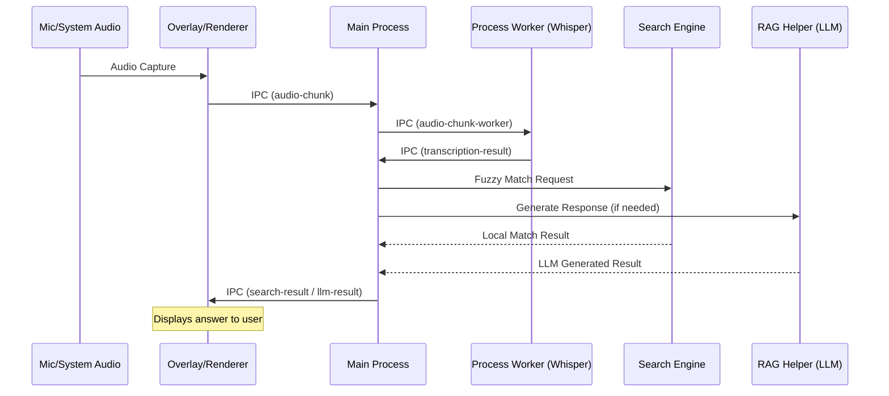

# Interview Assistant: Architecture & Data Flow

This document outlines the high-level architecture and data flow of the Interview Assistant software.

## 1. System Architecture

The application is built using the **Electron.js** framework, following a multi-process architecture to ensure a responsive UI and non-blocking background processing.

### 1.1 Process Model
- **Main Process (`main.js`)**: The application's core. It manages window lifecycles, global hotkeys, IPC (Inter-Process Communication) routing, and orchestrates calls to various services like the Search Engine and RAG Helper.
- **Renderer Processes**:
  - **Control Panel (`index.html`)**: The primary interface for configuring settings (tone, search priority), managing MCP servers, and loading context documents.
  - **Transparent Overlay (`overlay.html`)**: An always-on-top, click-through window that displays real-time transcriptions and AI-generated answers.
  - **Process Worker (`process-worker.html`)**: A hidden background renderer dedicated to CPU-intensive tasks like audio transcription (Whisper) to prevent Main thread lag.
  - **Puter AI Worker (`puter-ai-worker.html`)**: A specialized worker for interacting with the Puter.js AI ecosystem.

### 1.2 Key Components
- **`RagHelper` (RAG Engine)**:
  - **Context Management**: Parses and stores text from uploaded PDF, MD, and TXT files.
  - **STT Correction**: Uses regex-based logic to fix common transcription errors (e.g., "gentic eye" → "agentic AI").
  - **LLM Orchestration**: Implements a fallback chain: **Mistral AI** (Cloud) → **Ollama** (Local Llama 3) → **Puter AI**.
  - **Vision Engine**: Handles screen analysis using **Gemini 2.0 Flash** (Cloud) with a fallback to **LLaVA** (Local).
- **`SearchEngine`**: A fuzzy-search matching engine that checks incoming questions against a local knowledge base (`hr_interview_questions.json`).
- **`MCP Manager`**: Manages Model Context Protocol connections to pull in external documentation or tool-specific context for the LLM.
- **`Opik` Integration**: Provides observability and tracing for every LLM interaction, allowing for debugging and performance monitoring.

---

## 2. Data Flow Cycles

### 2.1 Audio-to-Answer Pipeline
This is the "heartbeat" of the application, running continuously during an interview.

### 2.2 Screen Analysis (Vision) Pipeline
Triggered manually by the user via a global hotkey (`Ctrl+Shift+S`).

1. **Trigger**: User hits the hotkey.
2. **Capture**: `Main Process` uses Electron's `desktopCapturer` to grab a high-quality frame of the screen.
3. **Transmission**: The base64 image is passed to `RagHelper.generateVisionResponse`.
4. **Recognition**:
   - `RagHelper` sends the image to **Gemini 2.0 Flash**.
   - If Gemini fails/timeout, it falls back to a local **LLaVA** instance via Ollama.
5. **Display**: The resulting analysis/answer is sent back to the Overlay and Control Panel via `llm-result`.

### 2.3 Context & RAG Loading
1. **Selection**: User selects resume or technical docs in the Control Panel.
2. **Processing**: `Main Process` receives paths and tells `RagHelper` to load them.
3. **Parsing**: `RagHelper` reads the files, parses PDFs, and truncates content to fit LLM context limits (~30k chars).
4. **Injection**: For every subsequent AI query, this context is injected into the system prompt to ensure "personalized" and accurate answers.

---

## 3. Technology Stack SUMMARY

| Layer | Technology |
| :--- | :--- |
| **Framework** | Electron |
| **Transcription** | OpenAI Whisper (Local) |
| **Primary LLM** | Mistral Large / Small (API) |
| **Local LLM** | Ollama (Llama 3.2 / LLaVA) |
| **Vision** | Gemini 2.0 Flash / LLaVA |
| **Search** | Fuzzy JavaScript Logic |
| **Observability** | Opik |
| **Context Protocol** | Model Context Protocol (MCP) |

---

## 4. UI/UX Interaction
- **Overlay Positioning**: Moved via `Alt + Arrows`.
- **Visibility**: Toggle Control Panel with `Alt + H`.
- **Locking**: The overlay can be "locked" (click-through) or "unlocked" (interactable) to edit/copy text via the Control Panel.
